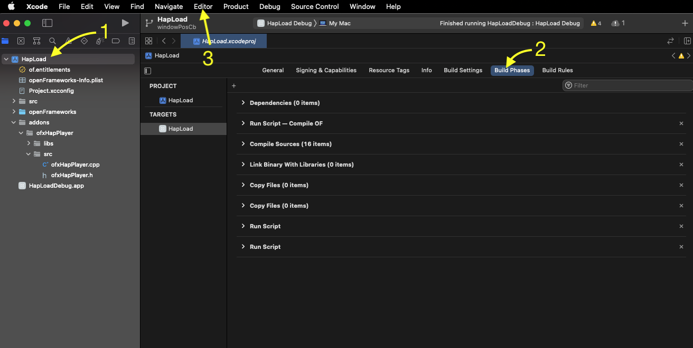
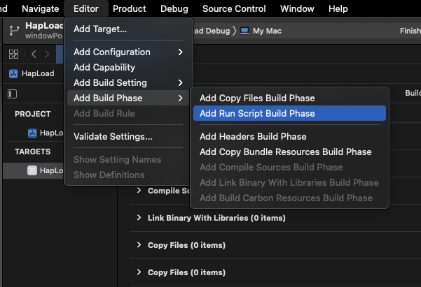
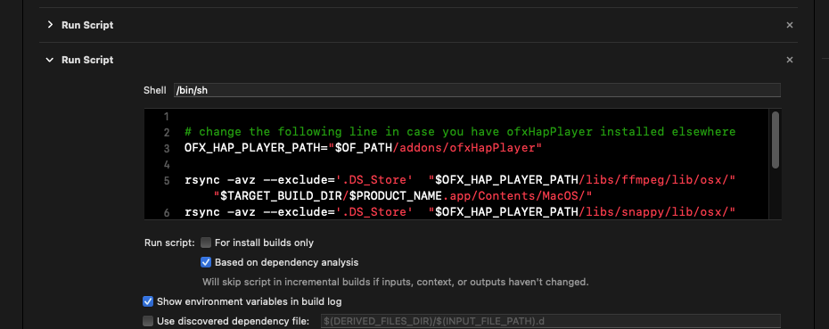

# ofxHapPlayer


A Hap player for OpenFrameworks on macOS, Windows and Linux.

Hap is a codec for fast video playback. You can learn more about Hap, and find codecs for encoding, at the [main Hap project](https://github.com/Vidvox/hap).


## Installation


This repo has branches for major OF versions. Use the branch which matches the version of OF you are using. The [master](https://github.com/bangnoise/ofxHapPlayer/tree/master) branch matches the current OF release.

For example, if you want to use the addon with OpenFrameworks 0.9.x:

    $ cd addons/ofxHapPlayer
    $ git checkout OpenFrameworks-0.9

## IMPORTANT (MAC OS and Xcode)
The libraries were updated so this have to be embeded in the app bundle, this way the app can be portable.
Make sure you update your project with Project Generator before anything.


There are 2 options. Choose either but not both

#### Option 1
After the first time you compile and run the app will crash saying it could not find some dylib files. Dont panic. Do as follows.

In the terminal, `cd` into the folder of your project that uses ofxHapPlayer


Something like:

```
cd openFrameworks/apps/myApps/myHapPlayerApp
```

then, in the finder, find the ofxHapPlayer folder.
Inside of it find the file `copy_dylibs_macos.sh`, then drag and drop it into the Terminal window. The full route to this file will now be shown in the terminal. Press ENTER. 
That Should copy the needed libraries.

Now run the app and it will be fine.
On subsequent compile runs the dylibs will remain in place so there is no need to copy each time you compile. Do it only if it crashes with the error that it cant find the dylib.


#### Option 2

You will need to do the following only once after generating/updating your project with Project Generator. (if you run your project through project generator you will need to do it again>

Select the project in the project navigator, then select Build Phases



Then Xcode's top menu select Editor > Add Build Phase > Add Run Script Build Phase.




Expand the newly added Run Script build phase and paste the following into its text area.


```

# change the following line in case you have ofxHapPlayer installed elsewhere
OFX_HAP_PLAYER_PATH="$OF_PATH/addons/ofxHapPlayer" 
	
rsync -avz --exclude='.DS_Store'  "$OFX_HAP_PLAYER_PATH/libs/ffmpeg/lib/osx/" "$TARGET_BUILD_DIR/$PRODUCT_NAME.app/Contents/MacOS/"
rsync -avz --exclude='.DS_Store'  "$OFX_HAP_PLAYER_PATH/libs/snappy/lib/osx/" "$TARGET_BUILD_DIR/$PRODUCT_NAME.app/Contents/MacOS/"
```





Now compile.
 


## Linux Requirements


This step is only necessary on Linux. On macOS and Windows, the required libraries are bundled with the addon.

On Linux, ofxHapPlayer uses system libraries. For Ubuntu, the following packages are required:

libsnappy-dev, libswresample-dev, libavcodec-dev, libavformat-dev, libdispatch-dev

    sudo apt-get install libsnappy-dev libswresample-dev libavcodec-dev libavformat-dev libdispatch-dev

Note that the Raspberry Pi does not support the compressed texture formats used by Hap, so you can't use this addon on a Raspberry Pi.

Pull-requests with instructions for other distributions are welcomed.


## Usage


Use the OF Project Generator to generate build files for your project, selecting ofxHapPlayer as an addon.

    #import "ofxHapPlayer.h"

ofxHapPlayer inherits from ofBaseVideoPlayer

    player.loadMovie("movies/MyMovieName.mov");

When you want to draw:

	player.draw(20, 20);

Note that there is no direct access to pixels and calls to getPixels() will return NULL.

## Advanced Usage


You can access the texture directly:

	ofTexture *texture = player.getTexture();

Note that if you access the texture directly for a Hap Q movie, you will need to use a shader when you draw:

    ofShader *shader = player.getShader();
    // the result of getShader() will be NULL if the movie is not Hap Q
    if (shader)
    {
        shader->begin();
    }
	texture.draw(x,y,w,h);
    if (shader)
    {
        shader->end();
    }
    
## Credits and License

ofxHapPlayer was written by [Tom Butterworth](http://kriss.cx/tom), initially in April 2013, supported by [Igloo Vision](http://www.igloovision.com/) and James Sheridan. Since then it has been supported by [Vidvox](http://vidvox.net/). It is released under a [FreeBSD License](http://github.com/bangnoise/ofxHapPlayer/blob/master/LICENSE).
